# Microsoft Ai-900 (Adrián Arenilla Seco) - Microsoft Learning Path Exercises

## Exercise 01: Use automated machine learning in Azure Machine Learning
Machine learning is a technique that uses mathematics and statistics to create a model that can predict unknown values.

### [Go to Learning Path Exercise 01 -->](https://docs.microsoft.com/en-gb/learn/modules/use-automated-machine-learning)

Create a new Machine Learning resource.
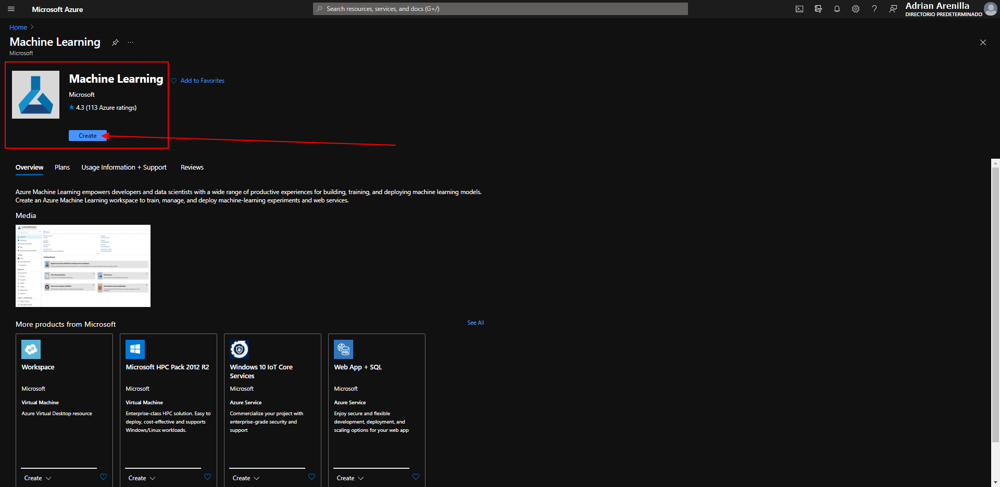

Create a new Machine Learning resource.
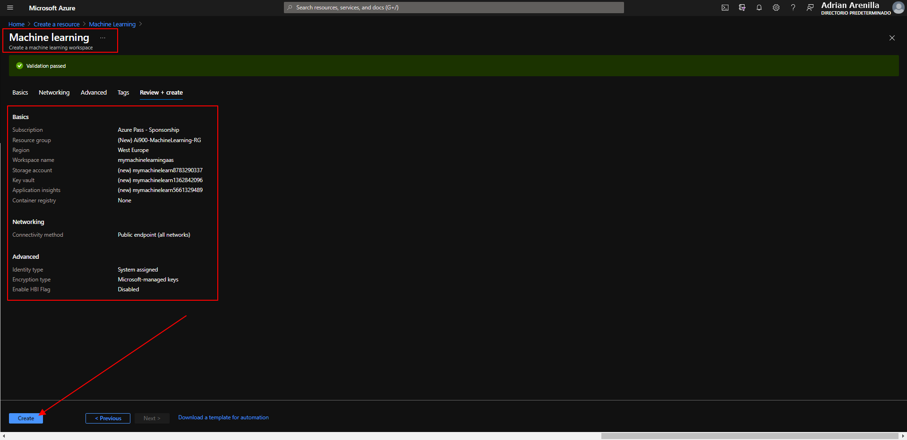

Sign into Azure Machine Learning studio using your Microsoft account. Select your Azure directory and subscription, and your Azure Machine Learning workspace.
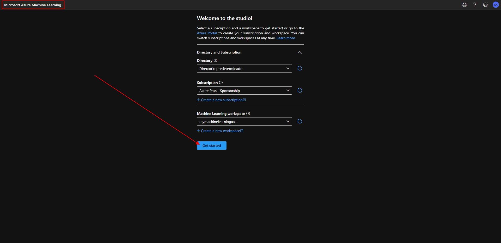

Create a new Compute instance.
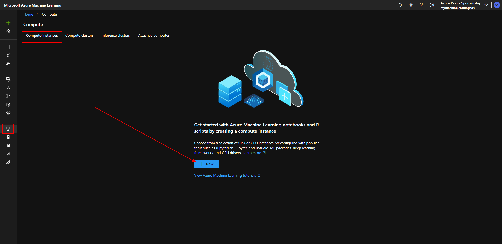

Fill in all exercise fields and create.
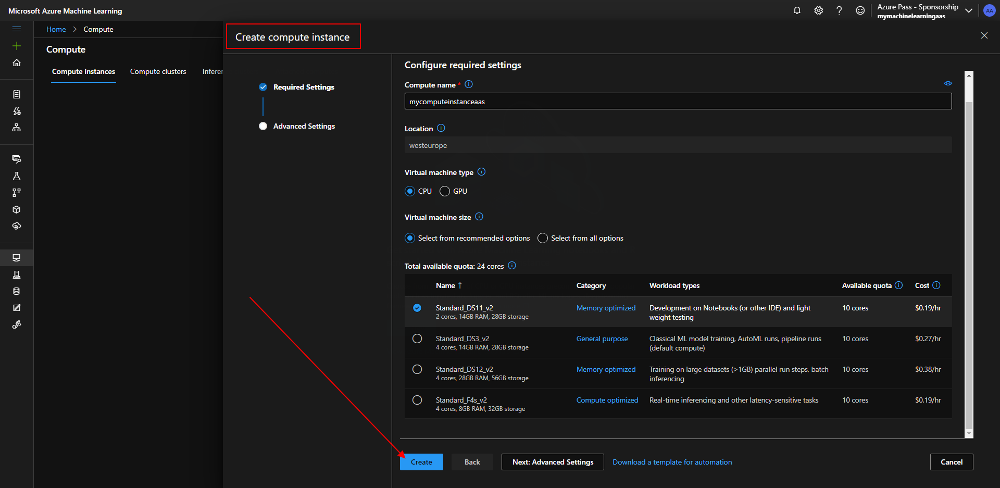

Create a new Compute cluster.

Verify that the cluster status is succeeded.
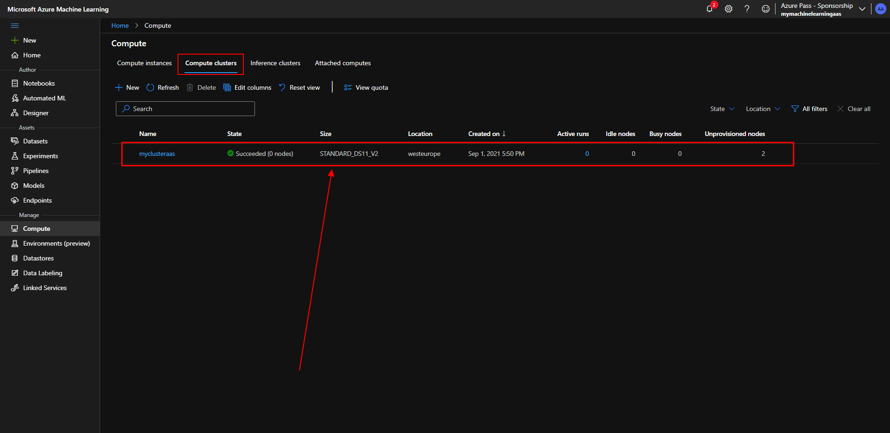

Create a new dataset from web files.
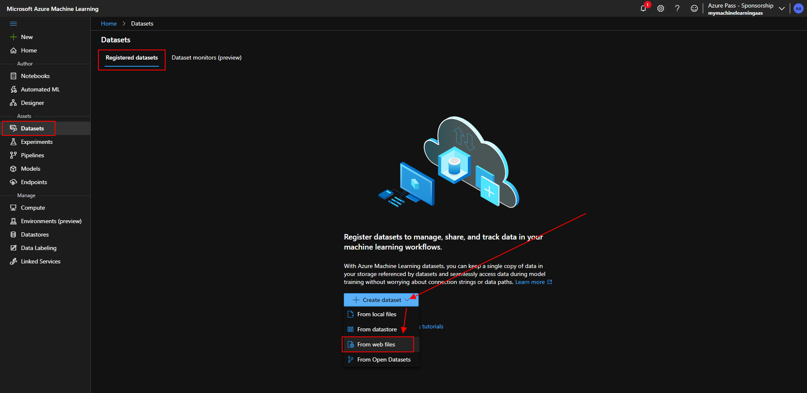

Fill in all exercise fields and create.
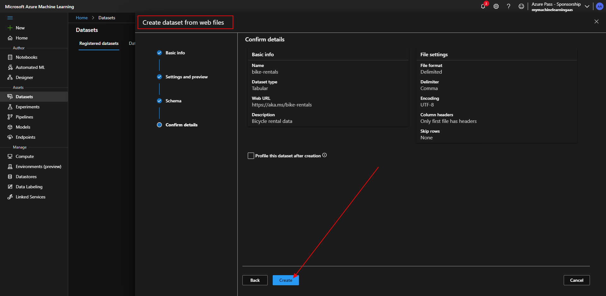

Check View additional configuration settings and View Featurization settings.
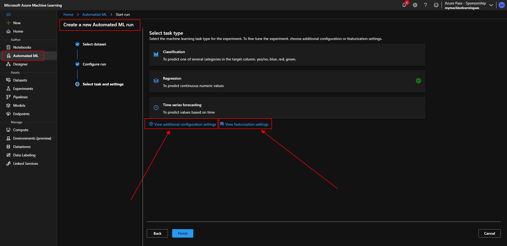

Verify additional configuration settings.
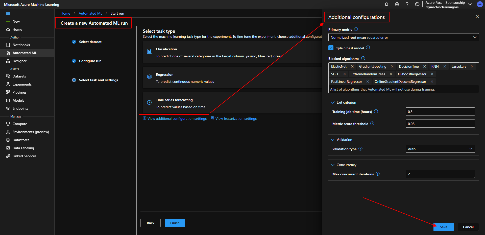

Observe as each possible combination of training algorithm and pre-processing steps is tried and the performance of the resulting model is evaluated.
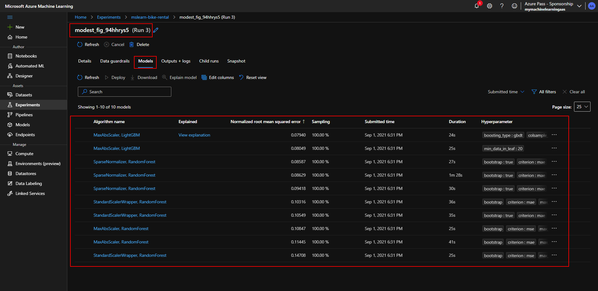

Wait for the experiment to finish.
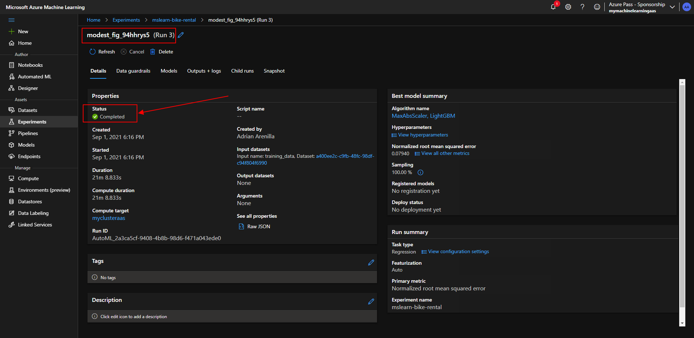

Select the Metrics tab and select the residuals and predicted_true charts if they are not already selected.
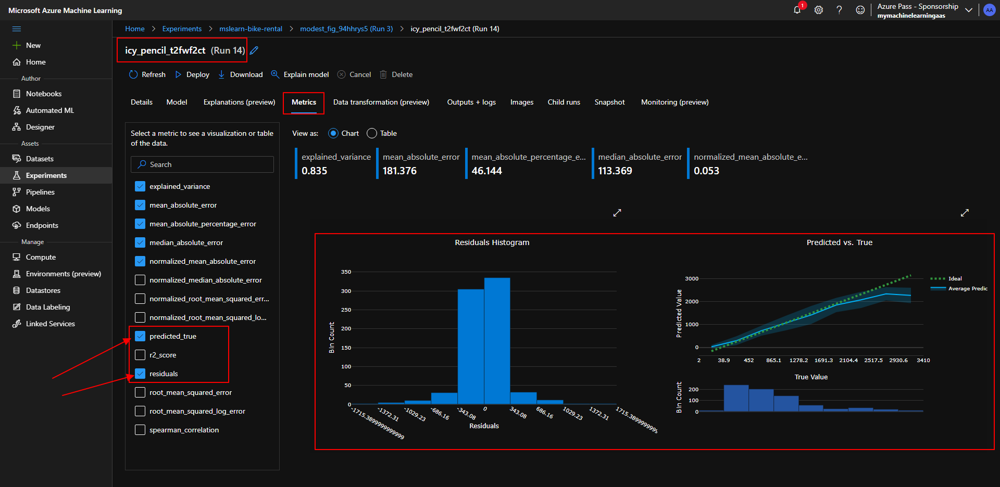

Deploy a model as a service.
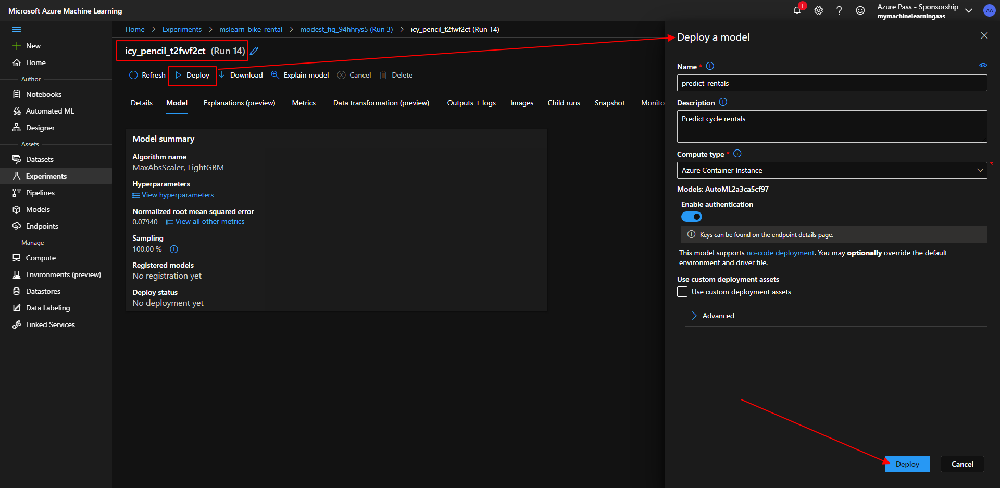

Verify the status to change to Successful.
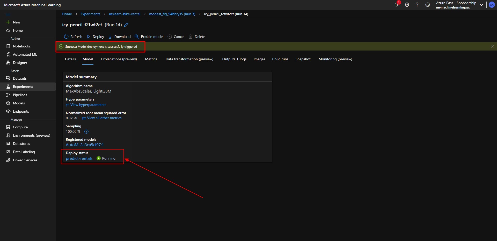

Wait until the deployment status is healthy.
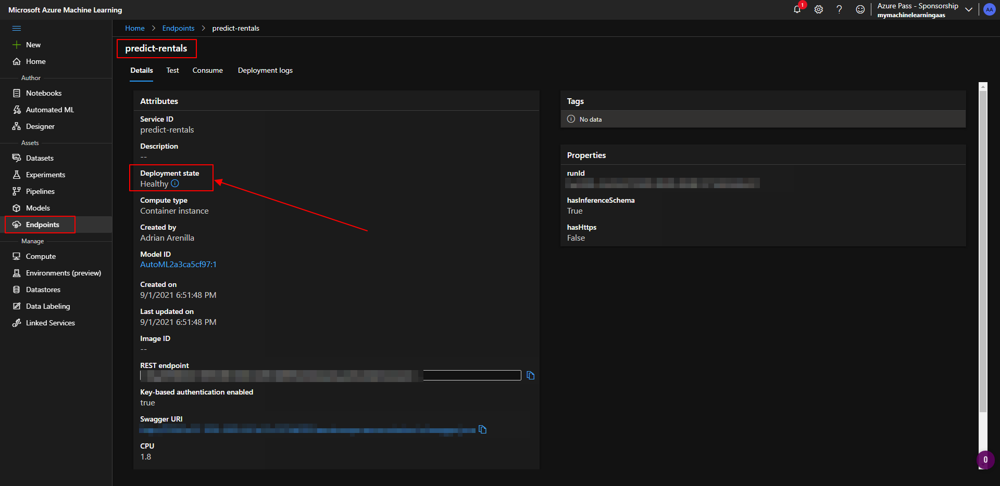

Create a new notebook file.
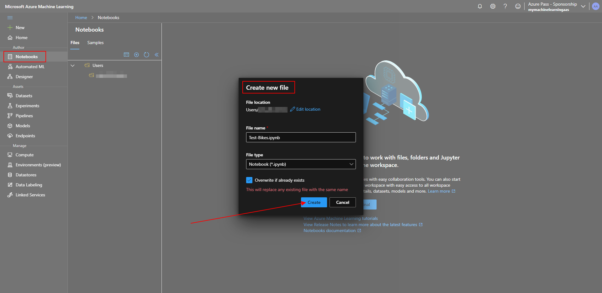

Verify that predicted number of rentals for each day in the five day period are returned.
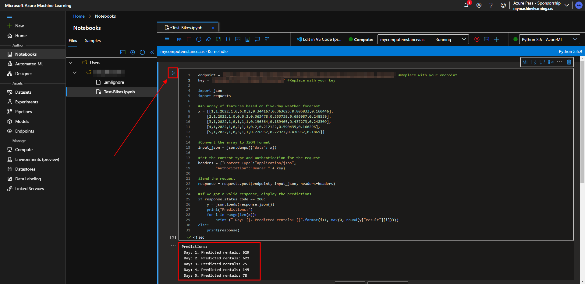

### [<-- Back to readme](../../../../)