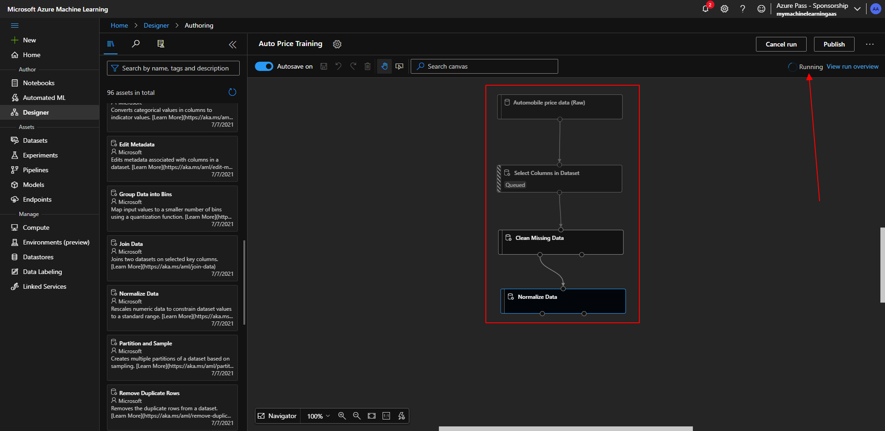

# Microsoft Ai-900 (Adrián Arenilla Seco) - Microsoft Learning Path Exercises

## Exercise 02: Create a Regression Model with Azure Machine Learning designer

### [Go to Learning Path Exercise 02 -->](https://docs.microsoft.com/en-gb/learn/modules/create-regression-model-azure-machine-learning-designer)

Sign into Azure Machine Learning studio using your Microsoft account. Select your Azure directory and subscription, and your Azure Machine Learning workspace.

Create a new Compute instance.

Fill in all exercise fields and create.

Create a new pipeline into Designer page.

Change the compute target on which to run the pipeline.

Go to preview data within the Automobile price data to review the schema of data.

Review the data.

Drag a Select Columns in Dataset module to the canvas.

Set the columns as in the image (Select Columns in Dataset).

Set the columns as in the image (Clean Missing Data).

Set the columns as in the image (Normalize Data).

Ensure your pipeline looks similar to the image and run the pipeline.

Correct result after running the pipeline.

Add and set training modules to the canvas and Submit.

Correct result after running the pipeline.

Note that next to the price column (which contains the known true values of the label) there is a new column named Scored labels, which contains the predicted label values.

Add and set an Evaluate Model module to the canvas and Submit.

Go to evaluation results section and view the results. These include the regression performance metrics.

Create and run an inference pipeline.
Your inference pipeline predicts prices for cars based on their features.

Deploy a predictive service.

Wait until the deployment status is healthy.

Create a new notebook file.

Verify that predicted price is returned.

### [<-- Back to readme](../../../../)