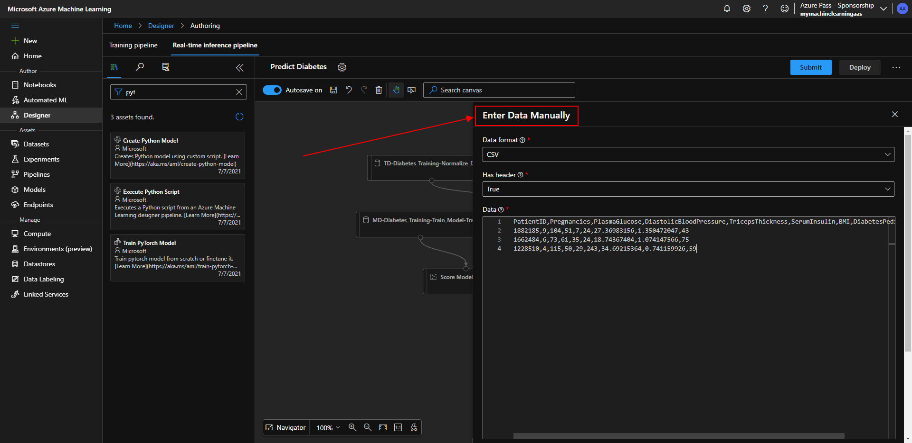
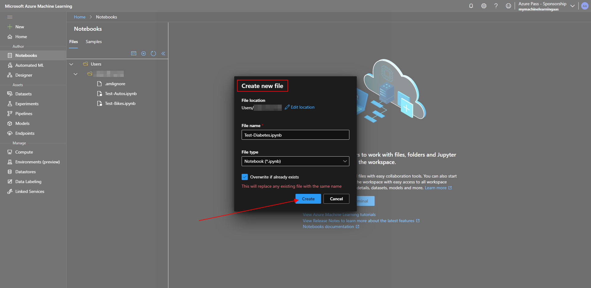

# Microsoft Ai-900 (Adrián Arenilla Seco) - Microsoft Learning Path Exercises

## Exercise 03: Create a classification model with Azure Machine Learning designer

### [Go to Learning Path Exercise 03 -->](https://docs.microsoft.com/en-gb/learn/modules/create-classification-model-azure-machine-learning-designer)

Create a dataset from web files.

Fill in all exercise fields and create.

Verify imported data from web file.

Change the compute target on which to run the pipeline.

Go to preview data within the diabetes-data to review the schema of data.

Set the columns as in the image (Normalize Data).

Ensure your pipeline looks similar to the image and run the pipeline.

Correct result after running the pipeline.

Add and set the Split Data module to the canvas.

Add and set the Train Model module to the canvas.

Add and set the Two-Class Logistic Regression module to the canvas.

Add and set the Score Model module to the canvas.

Add and set training modules to the canvas and Submit.

Correct result after running the pipeline.

Note a new column named Scored Probabilities columns containing a probability value between 0 and 1.

Add an Evaluate Model module to the canvas.

Select Submit, and run the pipeline using the existing experiment.

Correct result after running the pipeline.

Note the result to view the performance metrics.

Rename the new pipeline to Predict Diabetes within Real-time inference pipeline.

Add a new module (Enter Data Manually) to the canvas.

Add a new module (Execute Python Scrip) to the canvas.

Run the pipeline as a new experiment.

Correct result after running the pipeline.

Deploy a new real-time endpoint.

Wait until the deployment status is healthy.

Create a new notebook file.

Verify that predicted diabetes diagnosis is returned.

### [<-- Back to readme](../../../../)