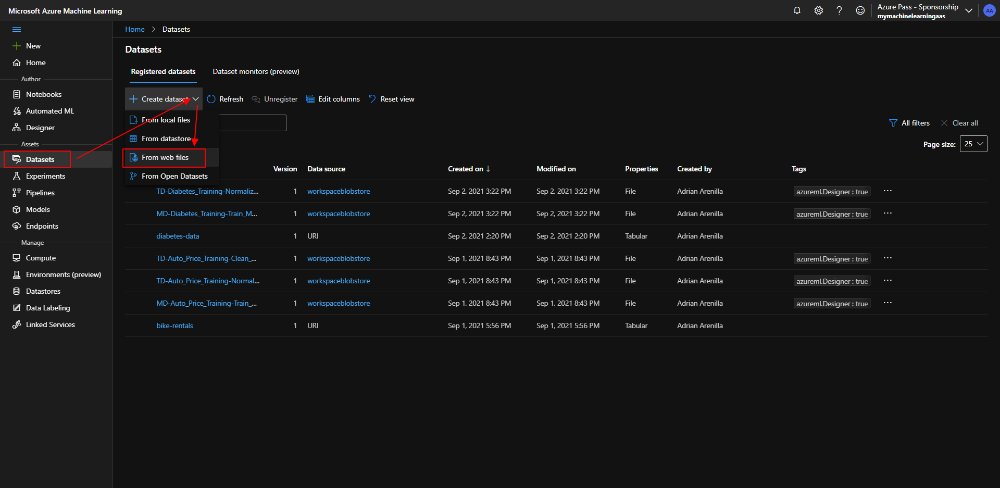
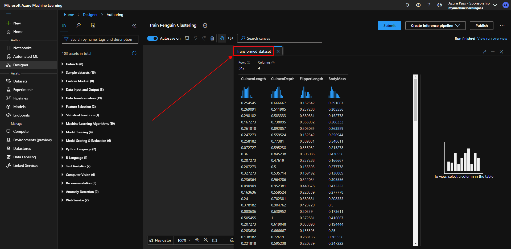
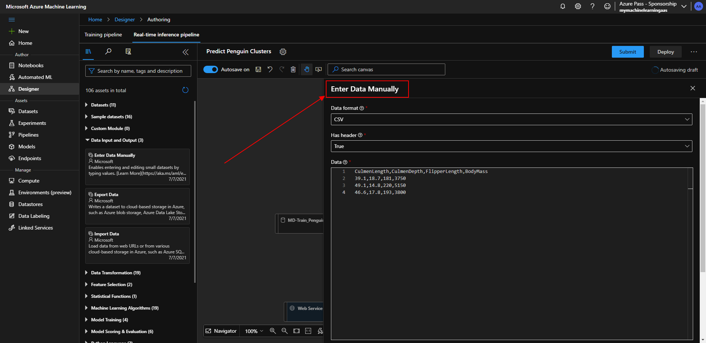
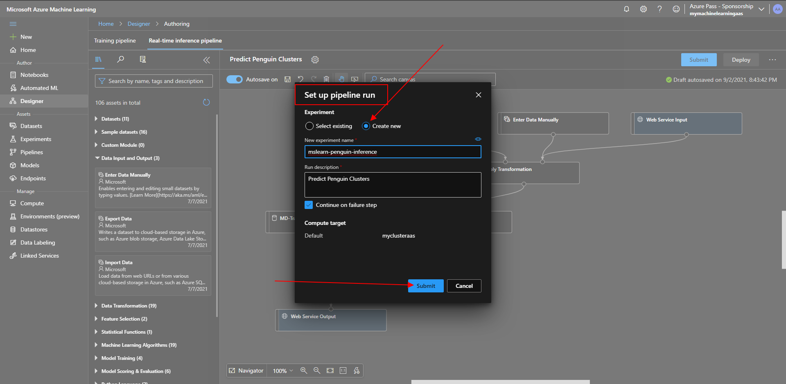

# Microsoft Ai-900 (Adrián Arenilla Seco) - Microsoft Learning Path Exercises

## Exercise 04: Create a Clustering Model with Azure Machine Learning designer

### [Go to Learning Path Exercise 04 -->](https://docs.microsoft.com/en-gb/learn/modules/create-clustering-model-azure-machine-learning-designer)

Create a dataset from web files.

Fill in all exercise fields and create.

Verify imported data from web file.

Change the compute target on which to run the pipeline.

Go to preview data within the penguin-data to review the schema of data.

Set the columns as in the image (Select Columns in Dataset).

Set the columns as in the image (Clean Missing Data).

Set the columns as in the image (Clean Missing Data).

Set the columns as in the image (Normalize Data).

Ensure your pipeline looks similar to the image and Submit the pipeline.

Set up pipeline run as new.

Correct result after running the pipeline.

View the data, noting that the Species column has been removed, there are no missing values, and the values for all four features have been normalized to a common scale.

Add and set the Split Data module to the canvas.

Add and set the Train Clustering Model module to the canvas.

Add and set the K-Means Clustering module to the canvas.

Ensure your pipeline looks similar to the image and Submit the pipeline.

Correct result after running the pipeline.

Note the Assignments column, which contains the cluster (0, 1, or 2) to which each row is assigned.

Add an Evaluate Model module to the canvas, select Submit, and run the pipeline using the existing experiment.

Correct result after running the pipeline.

Note the result to view the performance metrics.

Rename the new pipeline to Predict Penguin Clusters within Real-time inference pipeline.

Add a new module (Enter Data Manually) to the canvas.

Run the pipeline as a new experiment.

Set up pipeline run as new.

Correct result after running the pipeline and Deploy.

Deploy a new real-time endpoint.

Wait until the deployment status is healthy.

Create a new notebook file.

Verify that predicted cluster is returned.

### [<-- Back to readme](../../../../)